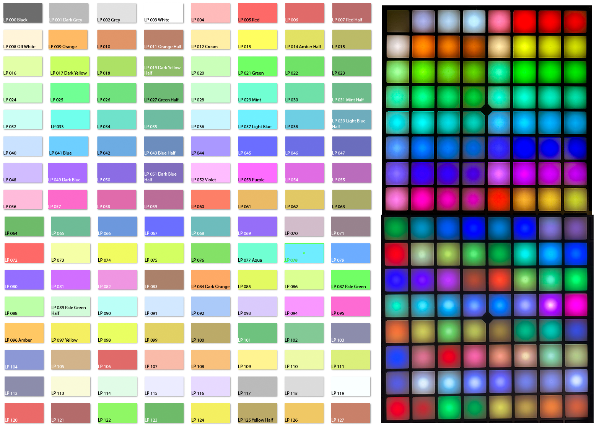

# Launchpad Colour Mod

This project provides a script to change the way the colours of clips in Ableton Live appear on the pads of your Launchpad Pro MK3.

It also works for other more recent Novation controllers, like the SL 61 MkIII keyboard.

## Umm… why?

We assign colours to the clips in the session view, so we know at a glance which clip does what when we are performing live.

Everyone has their own system of colour coding clips. For example, you might assign pink to breaks, turqoise to fills, yellow to hits, whatever helps you keep an overview over your set.

When performing live, you want to know at a glance, when looking at the pads on your Launchpad, which pads correspond to which clip slot on your lapttop's screen. You **don't** want to go, “OK, um, I want to launch a drum break next, what pad do I have to hit?” You want to go, “alrighty, let's do a drum break, here's my pink pad to launch it, let's go!”

You don't want to look at the laptop screen all the time, you want your eyes and fingers on the Launchpad.

There's a problem, though: most of the clip colours that Ableton Live has don't look anything alike the colours on the Launchpad. There's lots of light colours in Live that just show up as indistinguishable light grey on the Launchpad.

There are only a few Ableton Live slot colours that you can really work with, that are more or less adequately shown on the Launchpad and that can easily identified during a live performance.

I’ve found “Fire Hydrant Red”, “Tangerine”, “Durian Yellow”, “Pomelo Green”, “Tiffany Blue”, “Cosmic Cobalt”, “Plump Purple” and “Flamingo” to be useable. If I use these colours, I can clearly see which slot on the computer screen corresponds to which pad on the Launchpad.

But that’s only eight colours out of 70! The others are mostly useless, because they look different on the Launchpad and, what’s worse, are often indistinguishable from other colours.

This project changes all that.

Here is a comparison of the Launchpad colours with the default colours from Novation that comes with Ableton Live and the modified colours:


## How to install

Go to the [releases page](https://github.com/zapperment/launchpad-colour-mod/releases) and download the file _colors.pyc_ attached to the latest release.

Find this directory on your computer's file system, which is a subdirectory of where you've installed Ableton Live:

```
MIDI Remote Scripts/novation
```

On a Mac, this will most likely be:

```
/Applications/Ableton Live Suite.app/Contents/App-Resources/MIDI Remote Scripts/novation/
```

Copy the file _colors.pyc_ to this directory, overwriting the original file.

Restart Ableton Live — your Launchpad should now have the improved pad colours!

## ”It didn't work!”

I can give absolutely no guarantee that this will work on your machine! I've tested it on a Mac with Ableton Live version 12.1.1.

It is possible that your Launchpad or other Novation controller stops working with Live entirely with the modified version of _colors.pcy_.

If this is the case, you'll have to re-install Live to get it to work again. Use at your own risk.

## Development

You want to make your own adjustments to the colours? Read this.

### Prerequisites

You should have Python and [pyenv](https://github.com/pyenv/pyenv) installed on your Mac. And Ableton Live, obviously. I've run the script to modify the colours successfully with Live version 12.1.1.

Have a windows machine? You'll have to adjust the script _update-colours.sh_ accordingly.

### Setup

Set the correct Python version:

```
pyenv local
```

It should show version 3.11.1.

The whole thing will **definitely not** work with other Python versions!

### Running the script

There is a script called `mod-colours.sh`.

This compiles the Python source file `colors.py` that is located in the subdirectory `output/Live/mac_universal_64_static/Release/python-bundle/MIDI Remote Scripts/novation` and copies over the original `colors.pyc` module that is location in the Ableton Live app folder, under `MIDI Remote Scripts/novation`.

Run it like so:

```
./mod-colours.sh
```

Restart Ableton Live and enjoy the new colours!

### Changing the colours

Open the file [output/Live/mac_universal_64_static/Release/python-bundle/MIDI Remote Scripts/novation/colors.py](output/Live/mac_universal_64_static/Release/python-bundle/MIDI Remote Scripts/novation/colors.py).

Lines 62-270 define the mapping from the RGB values of the 70 clip colours in Live (the high numbers) to the 128 colours that the Launchpad can display (the low numbers after the colon).

Here is an approximation of what the Launchpad colours look like:



Assign the numbers 0-127 to the RGB values to change the colours on your Launchpad to your liking.

To test your changes, run the _mod-colours.sh_ script again and restart Ableton Live.
