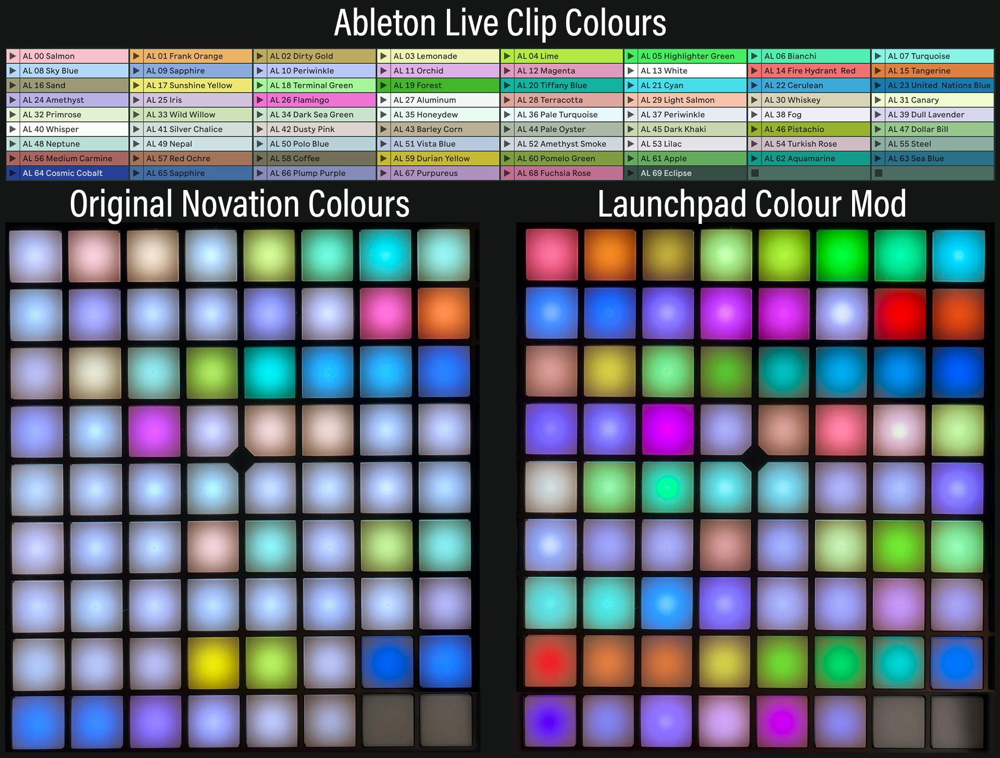

# Launchpad Colour Mod

This project provides a script to change the way the colours of clips in Ableton Live appear on the pads of your Launchpad Pro MK3.

It also works for other more recent Novation controllers, like the SL 61 MkIII keyboard.

## Umm… why?

We assign colours to the clips in the session view, so we know at a glance which clip does what when we are performing live.

Everyone has their own system of colour coding clips. For example, you might assign pink to breaks, turqoise to fills, yellow to hits, whatever helps you keep an overview over your set.

When performing live, you want to know at a glance, when looking at the pads on your Launchpad, which pads correspond to which clip slot on your lapttop's screen. You **don't** want to go, “OK, um, I want to launch a drum break next, what pad do I have to hit?” You want to go, “alrighty, let's do a drum break, here's my pink pad to launch it, let's go!”

You don't want to look at the laptop screen all the time, you want your eyes and fingers on the Launchpad.

There's a problem, though: most of the clip colours that Ableton Live has don't look anything alike the colours on the Launchpad. There's lots of light colours in Live that just show up as indistinguishable light grey on the Launchpad.

There are only a few Ableton Live slot colours that you can really work with, that are more or less adequately shown on the Launchpad and that can easily identified during a live performance.

I’ve found “Fire Hydrant Red”, “Tangerine”, “Durian Yellow”, “Pomelo Green”, “Tiffany Blue”, “Cosmic Cobalt”, “Plump Purple” and “Flamingo” to be useable. If I use these colours, I can clearly see which slot on the computer screen corresponds to which pad on the Launchpad.

But that’s only eight colours out of 70! The others are mostly useless, because they look different on the Launchpad and, what’s worse, are often indistinguishable from other colours.

This project changes all that.

Here's a live set in Ableton Live that has 70 clip slots, one for each colour of the Live palette:


Here is a comparison of the Launchpad colours with the default colour mapping from Novation that comes with Ableton Live (left) and the custom colour mapping version 1 provided by this project (right):



## Sorry, no Windows — for now

Currently, the script to update the colours only works on Macs. But it shouldn't be hard to figure out how to make it work on Windows. Make sure you use the correct Python version (3.11.1), find out where the _MIDI Remote Scripts_ directory is when Live is installed on Windows, and update the script `update-colours.sh` accordingly. If you have a Windows machine and have figured this out, I'll be happy to accept a pull request from you!

## Prerequisites

You should have [pyenv](https://github.com/pyenv/pyenv) installed on your Mac. And Ableton Live, obviously. I've run the script successfully with Live version 12.1.1.

## Setup

Set the correct Python version:

```
pyenv local
```

It should show version 3.11.1.

## Running the script

There is a script called `update-colours.sh`.

This compiles the Python source file `colors.py` that is located in the subdirectory `output/Live/mac_universal_64_static/Release/python-bundle/MIDI Remote Scripts/novation` and copies over the original `colors.pyc` module that is location in the Ableton Live app folder, under `MIDI Remote Scripts/novation`.

Run it like so:

```
./update-colours.sh
```

Restart Ableton Live and enjoy the new colours!
